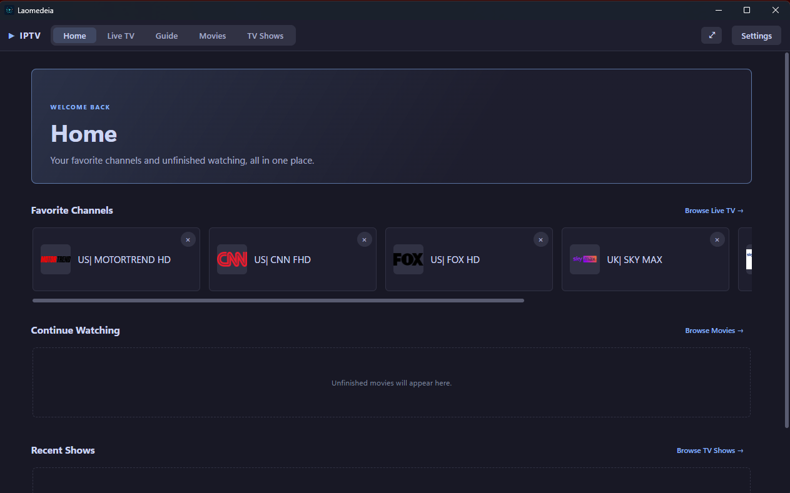
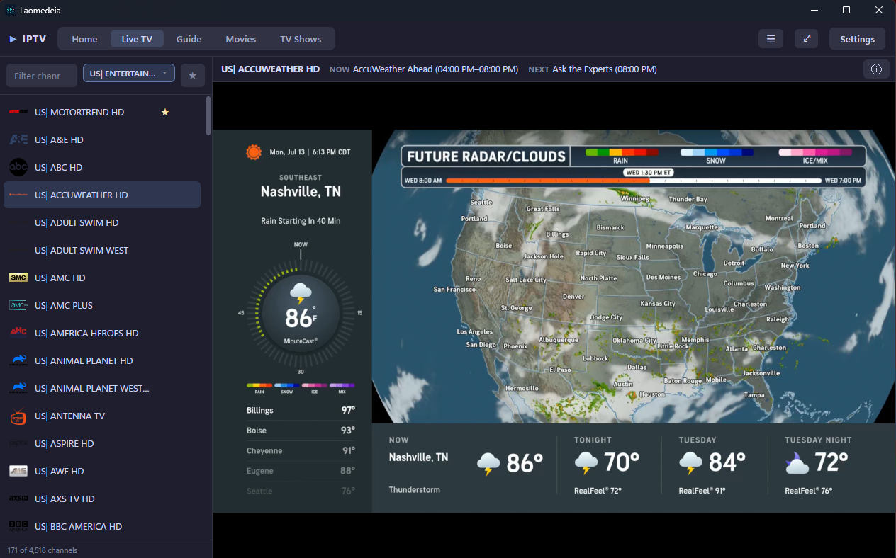
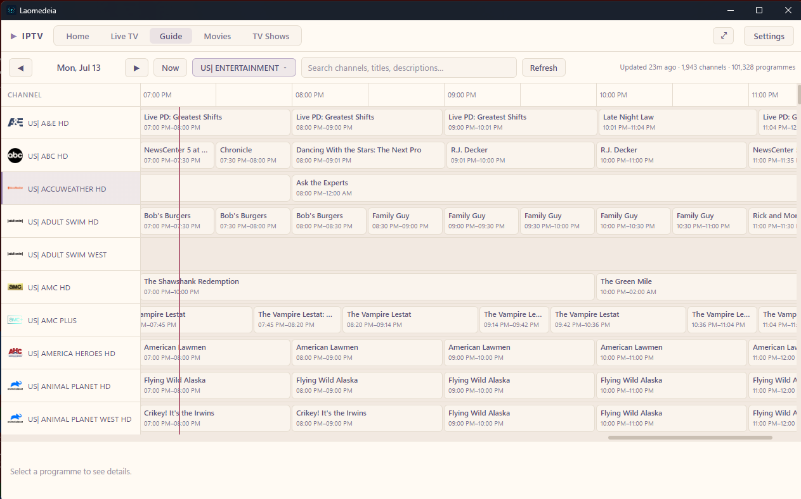

  

<h1 align="center">Laomedeia</h1>

  <b>A modern Windows IPTV viewer for Xtream-compatible providers.</b> 
  Fast Live TV, a virtualized programme guide, movies, and TV series — without the dated interface.

  
  
  
  

> [!IMPORTANT]
> **BETA v0.1** — core viewing features work, but this release is still completing
> release-readiness and clean-machine validation. The app can generate a sanitized
> diagnostic report from Settings if something goes wrong.

Pronounced **LAY-oh-muh-dee-ah** — named after one of Neptune's moons; the compass-and-play
icon nods to navigating a media universe.

## Screenshots

| Home | Live TV | Guide |
|---|---|---|
|  |  |  |

## Highlights

- ⚡ Fast, virtualized TV Guide built for thousands of channels
- 🔍 Search across channels, programme titles, and descriptions
- ⭐ Favorites, hidden channels, and keyboard zapping
- 🎬 Movie & TV Show browsers with posters, details, and resume playback
- 🏠 Home screen with your favorites and unfinished shows front and center
- 🎨 8 built-in themes (Catppuccin, Nord, Dracula, Tokyo Night, and more) plus custom JSON themes
- 🖥️ Full-screen cinema mode with auto-hiding controls
- 🛠️ Playback watchdog with automatic retry and recovery
- 🔒 Privacy-safe logs — credentials and stream URLs are never written to disk

## Getting Started

1. Download the latest Windows installer from [Releases](https://github.com/MrGibbage/laomedeia/releases)
2. Run `Laomedeia-Windows-<version>-Setup.exe`
3. Launch **Laomedeia** and enter your Xtream-compatible provider's URL, username, and
   password in Settings

You'll need your own lawful Xtream-compatible IPTV account — Laomedeia doesn't provide
channels, movies, or subscriptions.

📖 **[Full user guide](docs/USER_GUIDE.md)** — first-time setup, Live TV, Guide, Movies &
TV Shows, themes, diagnostics, updating/uninstalling

## Development

🛠️ **[Development setup](docs/DEVELOPMENT.md)** — stack, native libmpv build requirements,
dev commands, verification

## Project Documentation

- [Product Requirements](PRD.md)
- [Software Design](SDD.md)
- [Project Plan and Decision History](PLAN.md)
- [Release Readiness Checklist](RELEASE_READINESS.md)

---

Feature development is active; persistence formats may still evolve before a stable v1 release.

